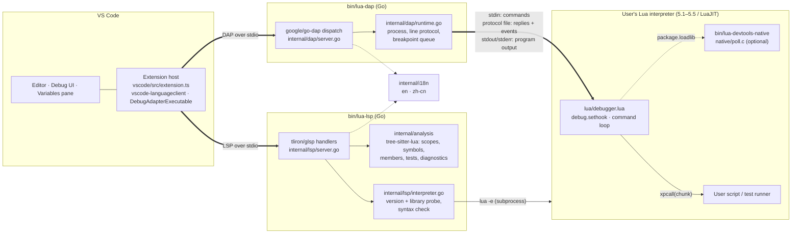
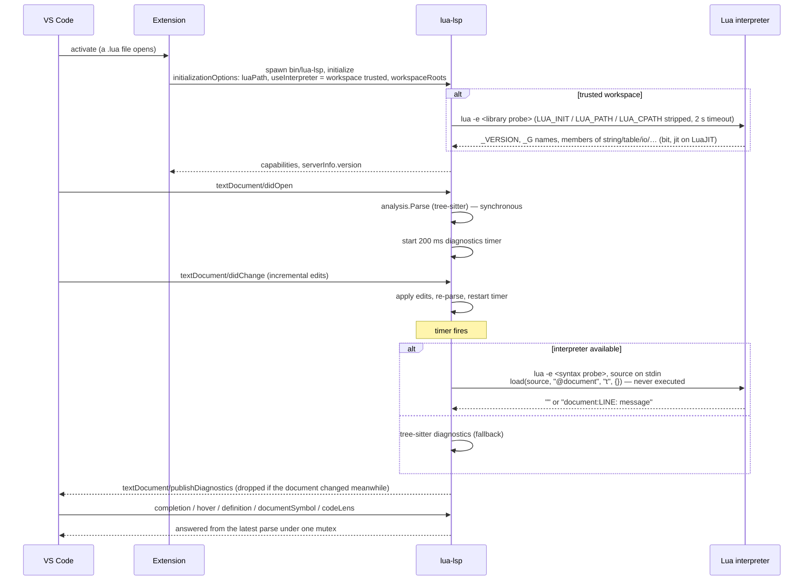
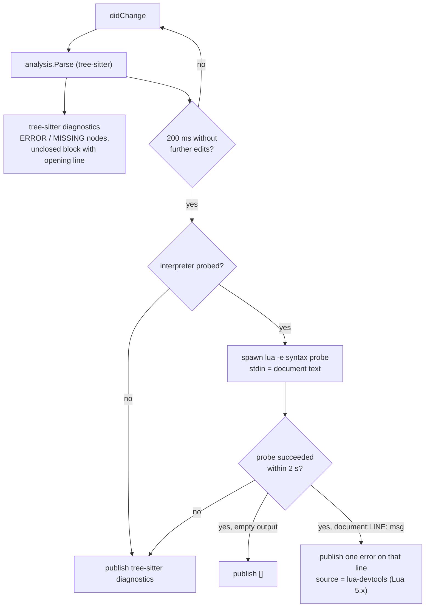
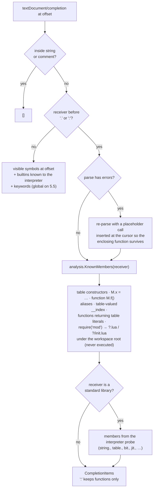
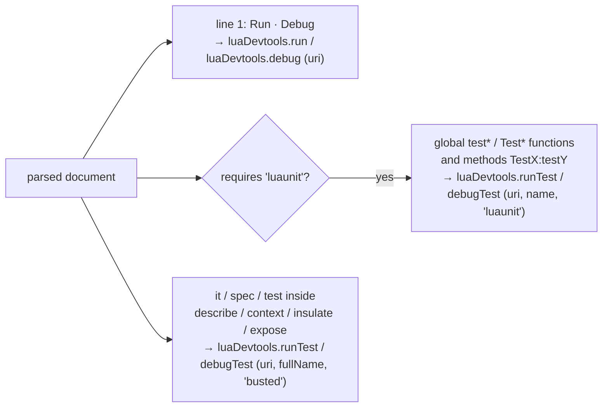
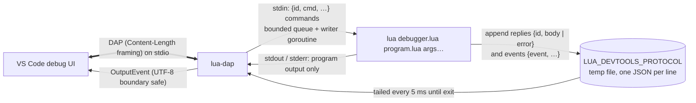
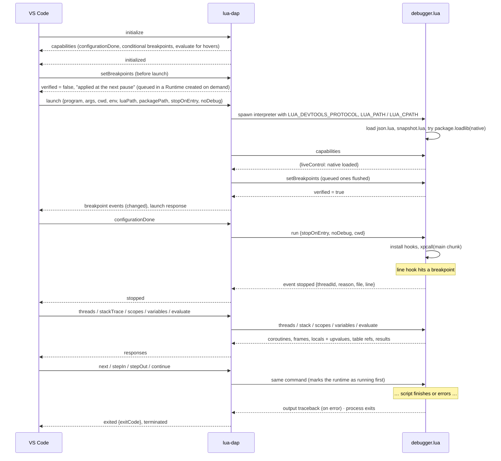
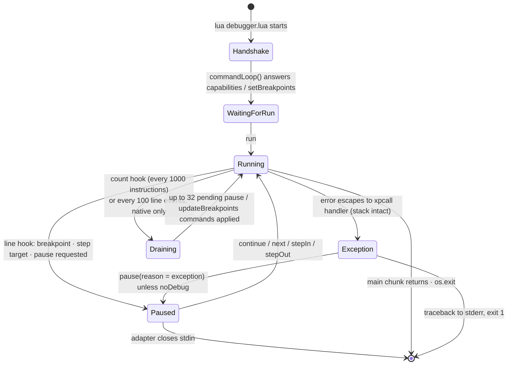
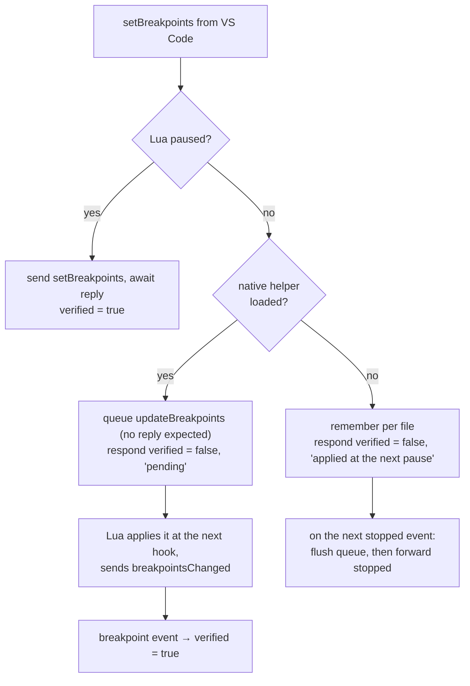
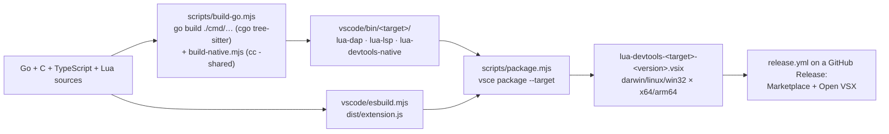

# Architecture

[English](architecture.md) · [简体中文](architecture.zh-CN.md)

How the extension, the two Go protocol servers and the in-process Lua debugger fit together, and what happens on the wire for each feature. Diagrams are Mermaid; GitHub and the VS Code Markdown preview render them.

## Components

| Piece | Role |
|---|---|
| `vscode/src/extension.ts` | Glue only: starts the language client, registers the debug adapter factory, the F5 configuration provider, the Run/Debug commands the code lenses call, interpreter selection (status bar) and the table JSON view. |
| `cmd/lua-lsp`, `internal/lsp` | Language server. Parses every open document with `internal/analysis`, optionally probes the selected interpreter, answers requests from the latest parse. |
| `internal/analysis` | tree-sitter parsing, scope tree, symbol resolution, static member inference, LuaUnit/Busted test discovery, syntax diagnostics. Byte offsets inside; UTF-16 conversion in `position.go`. |
| `cmd/lua-dap`, `internal/dap` | Debug adapter. Translates DAP requests into line-protocol commands for `debugger.lua` and its events back into DAP events. |
| `vscode/lua/debugger.lua` | Runs inside the debuggee under the user's interpreter. Installs `debug.sethook`, keeps breakpoints, walks stacks with the `debug` library, evaluates expressions. |
| `native/poll.c` | Optional, Lua-version-neutral C module: reports whether stdin is readable so commands can be picked up while the program runs. |
| `internal/i18n`, `vscode/l10n` | Messages of the Go servers and the extension in English and Simplified Chinese. |

Nothing is bundled but the Go binaries, the Lua files and the native helper: the language server and the debugger both run the interpreter the user selects (`luaDevtools.luaPath`, or `lua5.4` → Homebrew `lua@5.4` → `lua`).

## Language server (LSP)

### Capabilities

| Capability | Source of truth |
|---|---|
| Text sync (incremental) | `didOpen` / `didChange` / `didClose` keep the document text and re-parse immediately |
| Diagnostics (push) | Interpreter syntax check when available, tree-sitter `ERROR` / `MISSING` nodes and unclosed-construct heuristics otherwise |
| Completion (`.` and `:` trigger) | Member completion from static inference and the probed standard library; otherwise visible symbols, builtins, keywords |
| Definition | Member and `require` definitions across files first (`ImplementationAt`), then lexical symbols (`SymbolAt`) |
| Hover | Symbol signature with definition line, builtin documentation, or "undefined global" |
| Document symbols | Scope outline: functions, fields (`function M.f` / `M:f`), locals, globals |
| Code lens | `Run` / `Debug` on line 1; `Run Test` / `Debug Test` above LuaUnit and Busted cases |

### Startup and document lifecycle

Changing `luaDevtools.luaPath` or granting workspace trust restarts the client, which is how a new interpreter gets probed. Untrusted workspaces never spawn the interpreter and use the built-in Lua 5.4 analysis only.

### Diagnostics pipeline

The interpreter check is authoritative when it runs: Lua's own parser produces the canonical message (`'end' expected (to close 'function' at line 3) near <eof>`). It stops at the first error, so at most one interpreter diagnostic is shown per document.

### Completion

When no Lua source matches a `require` and `luaDevtools.probeNativeModules` is on, `lsp/native.go` looks for the shared library the interpreter would load (`?.so` / `?.dll` templates, including the all-in-one `a.so` for `a.b`), and only if one exists runs `pcall(require, name)` in the selected interpreter with the environment's `LUA_PATH` / `LUA_CPATH` to list the exported table. Results, including failures, are cached per library file (modification time and size). This is the one place analysis executes third-party code, which is why it is opt-in.

`moduleResolver` first uses the selected environment’s search templates (`packagePath` of the folder's Lua launch configurations, resolved by the extension through the `launch` configuration API, then project packages and the interpreter's `package.path`), scoped by workspace, then searches `?.lua` and `?/init.lua` under the containing workspace root and the source file's ancestor directories, prefers unsaved open documents over disk, and caps file size and dependency depth. Definitions found this way also power go-to-definition across files.

### Code lenses

The server only names commands; the extension executes them by starting a debug session (`noDebug` for Run). LuaUnit gets the test name as `arg[1]`; Busted runs through `lua/busted-runner.lua` with an escaped, anchored `--filter` so breakpoints stay in the spec file.

## Debug adapter (DAP)

### Processes and channels

Three channels keep the protocol out of the program's way:

- **stdin → Lua**: commands. Lua reads them while paused (blocking `read`), and, with the native helper, from inside debug hooks (`poll_stdin()` first, so the read never blocks).
- **protocol file → adapter**: replies and events. A regular file rather than an inherited pipe so it also works with an external Lua on Windows; the adapter tails it until the process exits.
- **stdout/stderr → adapter**: untouched program output, forwarded as `output` events. `print`, `io.write`, `io.stdout:write` and C modules all behave as they do outside the debugger.

### A debug session

`stopOnEntry` is implemented as a step-in from the first line. `noDebug` (Run Without Debugging) skips the hooks entirely and turns runtime errors into a plain traceback with exit code 1.

### Debuggee state machine

Inside `hook(event, line)`:

1. Hooks are ignored while the debugger itself runs code (`inDebugger`), so evaluating an expression never re-enters the debugger.
2. With the native helper, every count event or hundredth line event drains stdin: only `pause` and `updateBreakpoints` are accepted while running.
3. Frames from `debugger.lua` itself are skipped; the chunk's `source` is canonicalised through the adapter once (`resolvePath` event → `resolvedPath` reply) so breakpoint paths match after symlinks and `./` prefixes.
4. `shouldStop` checks breakpoints (conditions evaluated in the hitting frame; a failing condition still stops and reports) and the step mode. `next` and `stepOut` compare stack depth on the current coroutine only.
5. `pause(reason, info)` sends `stopped` and enters the blocking command loop until a resume command arrives.

### Breakpoint updates while the program runs

`pause` follows the same split: with the helper it is a fire-and-forget `pause` command that the next hook honours (reason `pause`); without it the request fails with an explanatory message. Commands sent while running never wait for a reply, so a program blocked in a C call cannot stall the adapter's request loop — `disconnect` and `terminate` still work.

### Coroutines, frames and variables

- `coroutine.create` / `coroutine.wrap` are wrapped to install the hook on the new thread and to register it; `coroutine.resume` is wrapped so stepping past a `yield` resumes in the caller. `threads` lists live coroutines (`1` = main).
- Frame ids: the active stack uses hook-relative ids `1..n`; suspended coroutines use `threadId × 1 000 000 + level`, so `scopes` / `variables` / `evaluate` can address a frame in any listed coroutine.
- Scopes are `Locals` (`debug.getlocal`, temporaries skipped) and `Upvalues` (`debug.getupvalue`); tables get a `variablesReference` that expands to at most 200 sorted entries. References are rebuilt on every pause.
- `evaluate` compiles the text first as `return <expr>`, then as a statement, in an environment whose `__index` / `__newindex` resolve locals, then upvalues, then `_G` — so assignments in the Debug Console change the paused program.
- The custom request `lua/snapshot {variablesReference}` returns a JSON snapshot of a table (`snapshot.lua` policy: depth 32, 10 000 values, 512 KiB, no metamethods); the extension shows it in a read-only `lua-table:` document.

### The native polling helper

`native/poll.c` exports one function, `poll_stdin()`, using only `lua_createtable`, `lua_pushcclosure`, `lua_setfield` and `lua_pushboolean`, whose signatures are identical from Lua 5.1 to 5.5 and LuaJIT. On macOS/Linux the symbols resolve from the host process at `dlopen` time; on Windows the module enumerates loaded modules and picks the one that exports the Lua API, whatever its DLL name (and refuses to load if there are two). `debugger.lua` loads it with `package.loadlib` from `bin/` next to the servers, honours `LUA_DEVTOOLS_NATIVE=<path>` or `off`, switches stdin to unbuffered so kernel readiness matches what `read` will return, and silently falls back to pure Lua if anything fails.

## Build and delivery

CI (`ci.yml`) builds every target on a matching runner (cgo cannot cross-compile), runs `go test -race -tags=integration`, the LSP/DAP smoke tests over stdio and the VS Code end-to-end suite, then packages. Separate jobs build Lua 5.1–5.5 and a pinned LuaJIT from source and run the debugger tests both with the native helper and with `LUA_DEVTOOLS_NATIVE=off`, so the pure-Lua fallback stays covered.

## Where to look

| Question | File |
|---|---|
| How a DAP request becomes a Lua command | `internal/dap/server.go` → `internal/dap/runtime.go` |
| Wire format of commands, replies and events | header comment of `vscode/lua/debugger.lua`, `message` struct in `runtime.go` |
| Why breakpoints show "pending" or "applied at the next pause" | `Runtime.SetBreakpoints`, `flushPendingBreakpoints` |
| How a completion list is assembled | `internal/lsp/server.go` (`completion`), `internal/lsp/completion.go`, `internal/analysis/members.go` |
| Interpreter probes | `internal/lsp/interpreter.go` (`libraryProbe`, `syntaxProbe`) |
| Test discovery | `internal/analysis/luaunit.go`, `internal/analysis/busted.go` |
| Extension wiring, commands, settings | `vscode/src/extension.ts`, `vscode/package.json` |

## Extended language and debugger services

`analysis/refactoring.go` follows lexical bindings for references and local rename, rejecting capture in both directions. `analysis/references.go` extends both to globals and table members: `ReferenceTargetAt` classifies the name under the cursor, and a member gets an identity of *(owning table, field name)* where the table is the module file URI for exported tables (so identities compare across files) or a per-parse table pointer otherwise. The identity replay applies every member write in the file regardless of scope, follows aliases, `__index` chains and `require`d modules, and records the first declaration of each field; which table a *name* is bound to at a site is replayed per site in source order, and a site is flagged undecidable when its name is rebound in a branch, loop or function the analysis cannot order relative to the site (references still list such sites by their source-order binding; rename refuses). `lsp/workspace.go` then scans the workspace roots plus open documents (skipping hidden directories and `node_modules`, bounded by file count and size, prefiltered by name), parses each candidate with module resolution and collects matching sites; rename builds one `TextDocumentEdit` per file (versioned for open documents) and rejects names that an existing member, a global or a capturing local would collide with, as well as members whose declaring file the scan does not cover (installed packages, files outside the workspace), since their declaration would be left behind. LSP returns versioned document edits. `analysis/signature.go` resolves static callees and argument positions, including module definitions supplied by the existing bounded module resolver.

The transport diagrams above describe ordinary launch. Optional `transport.lua` uses LuaSocket TCP for attach and interactive launch. Interactive launch creates an authenticated loopback connection, leaving stdin for program data through a bounded input queue. Attach connects to a cooperating host; disconnect closes the transport and restores hooks, coroutine APIs and JIT state without killing the host. See the [debugging guide](debugging.md).

`lua/resumeCoroutine` runs a suspended coroutine without arguments, then stops again at a breakpoint, yield or completion. Opt-in caught-error inspection preserves the failed coroutine stack until continue. Snapshot fallback encodes object identities and typed keys in `lua-table-v1`; the same depth/value/byte limits apply before rendering the read-only document.
