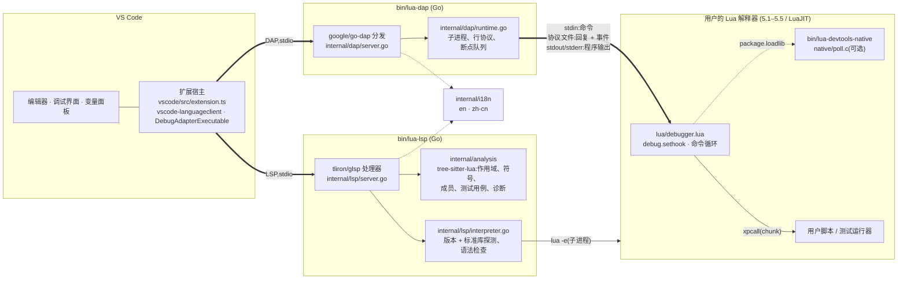
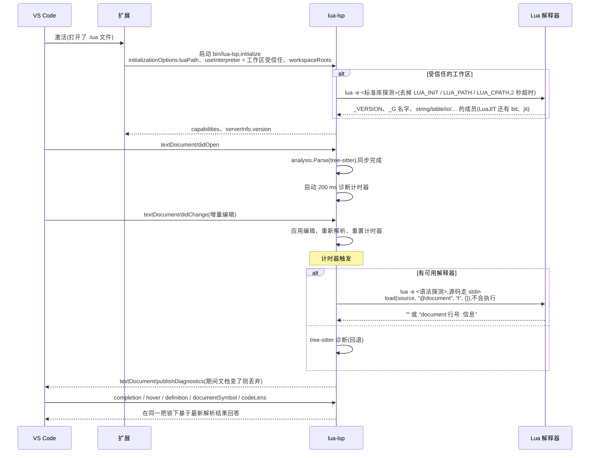
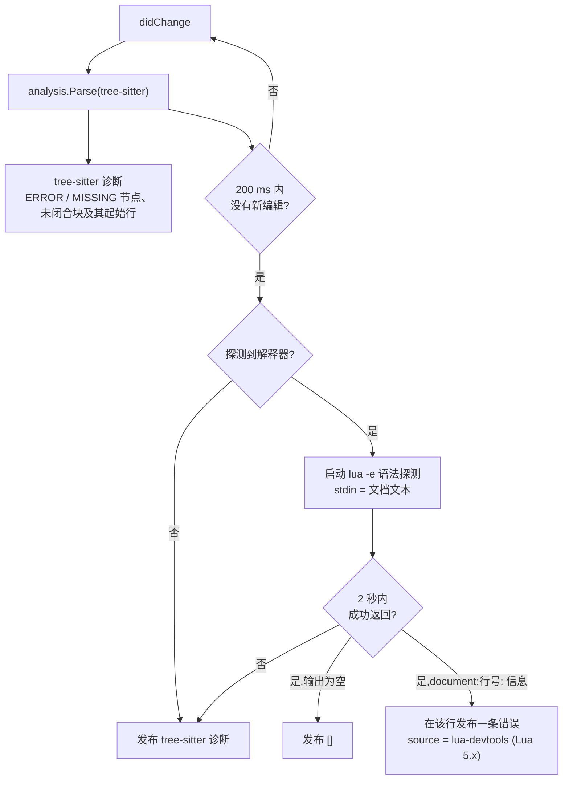
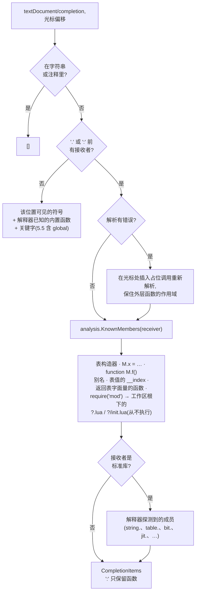
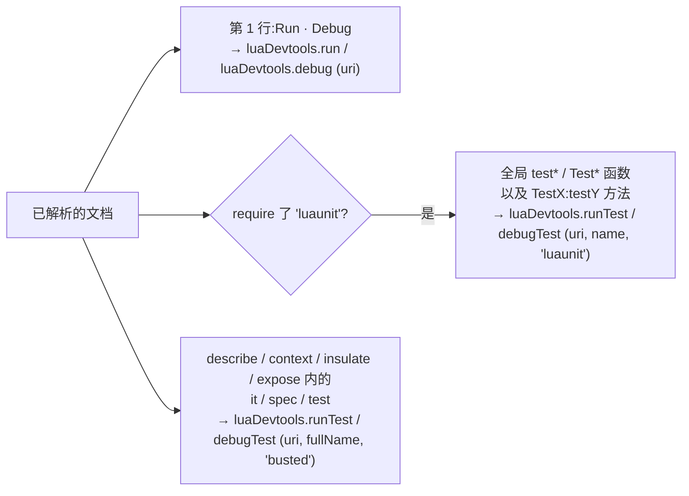
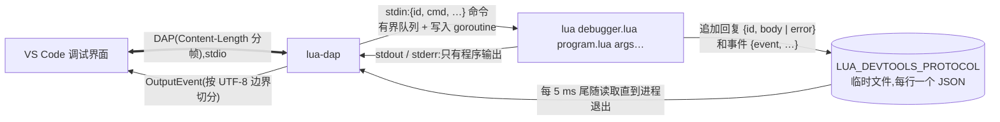
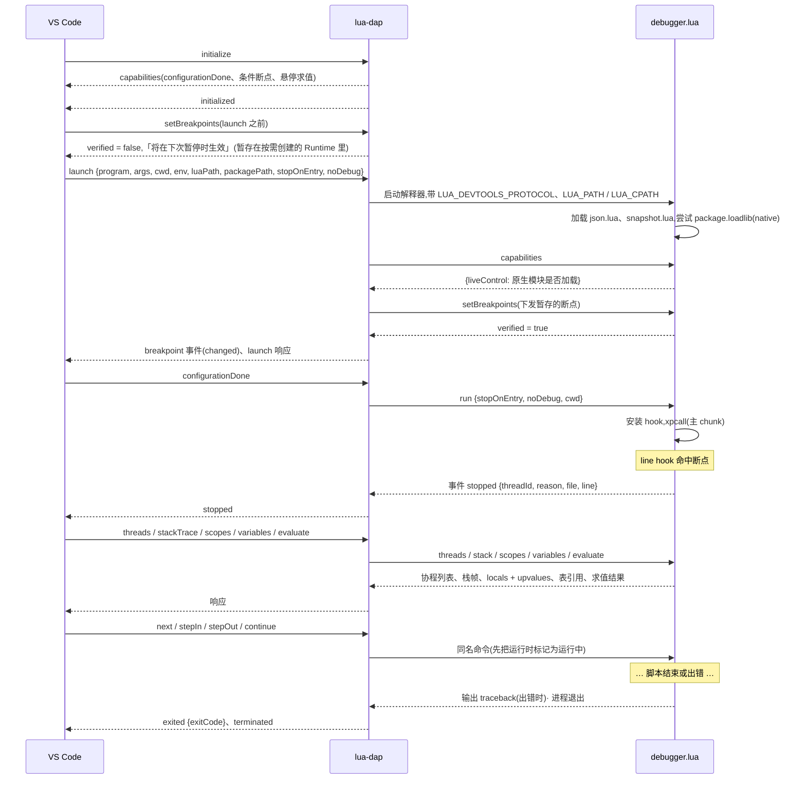
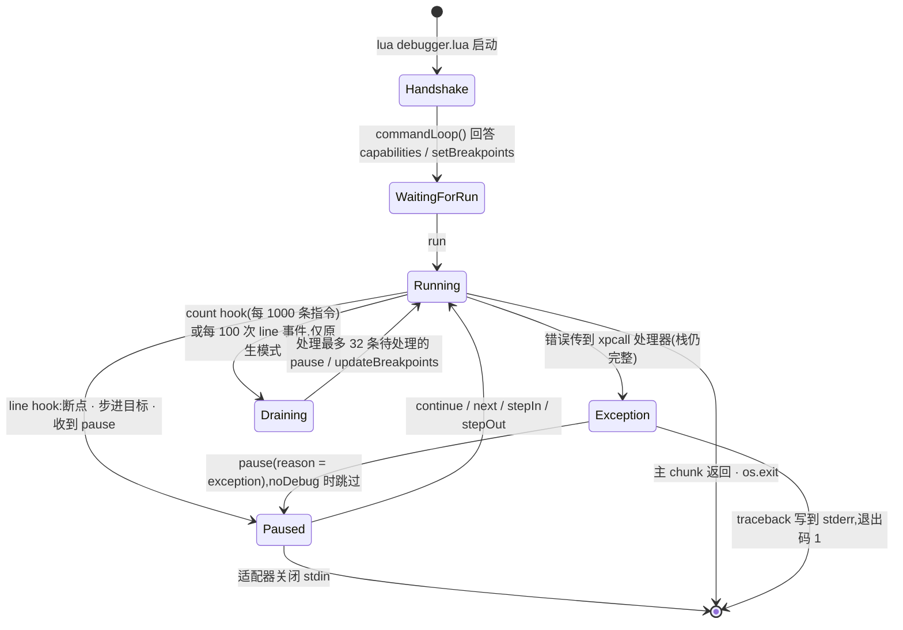
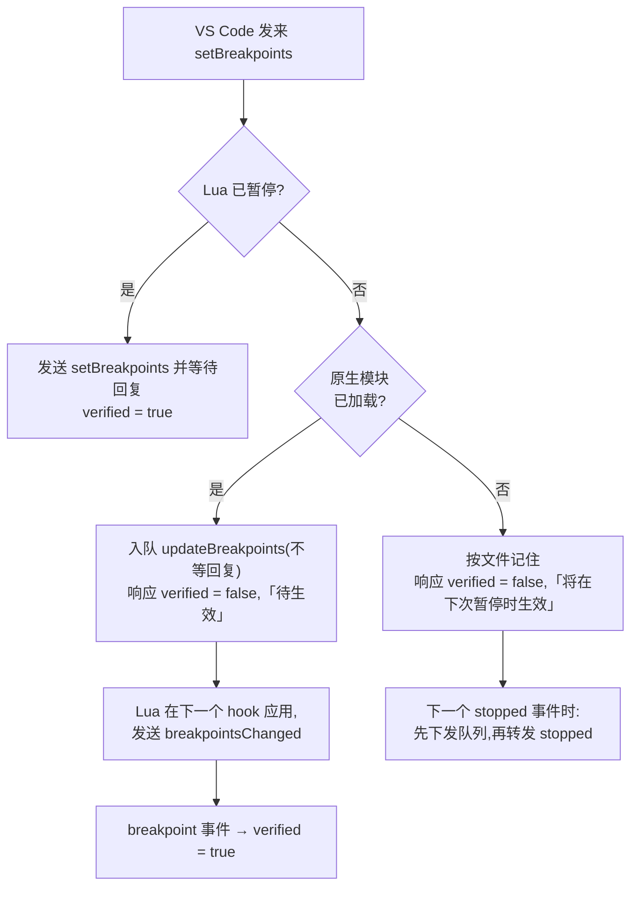
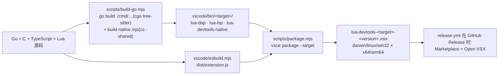

# 架构

[English](architecture.md) · [简体中文](architecture.zh-CN.md)

本文说明扩展、两个 Go 协议服务器和运行在被调试进程内的 Lua 调试器是如何组合在一起的,以及每个功能在协议上经过了哪些步骤。图使用 Mermaid,GitHub 和 VS Code 的 Markdown 预览都能渲染。

## 组件

| 部分 | 职责 |
|---|---|
| `vscode/src/extension.ts` | 只做粘合:启动语言客户端,注册调试适配器工厂、F5 配置提供者、CodeLens 调用的 Run/Debug 命令、解释器选择(状态栏)和表 JSON 视图。 |
| `cmd/lua-lsp`、`internal/lsp` | 语言服务器。用 `internal/analysis` 解析每个打开的文档,按需探测所选解释器,请求都基于最新一次解析结果回答。 |
| `internal/analysis` | tree-sitter 解析、作用域树、符号解析、静态成员推断、LuaUnit/Busted 测试发现、语法诊断。内部使用字节偏移,UTF-16 转换在 `position.go`。 |
| `cmd/lua-dap`、`internal/dap` | 调试适配器。把 DAP 请求翻译成 `debugger.lua` 的行协议命令,把它的事件翻译回 DAP 事件。 |
| `vscode/lua/debugger.lua` | 在用户的解释器里、被调试进程内运行。安装 `debug.sethook`,维护断点,用 `debug` 库遍历栈、求值表达式。 |
| `native/poll.c` | 可选的、与 Lua 版本无关的 C 模块:报告 stdin 是否可读,让程序运行中也能收到命令。 |
| `internal/i18n`、`vscode/l10n` | Go 服务器和扩展的中英文文案。 |

除了 Go 二进制、Lua 文件和原生辅助模块,扩展不打包任何东西:语言服务器和调试器都运行用户选择的解释器(`luaDevtools.luaPath`,否则依次尝试 `lua5.4` → Homebrew `lua@5.4` → `lua`)。

## 语言服务器(LSP)

### 能力

| 能力 | 数据来源 |
|---|---|
| 文本同步(增量) | `didOpen` / `didChange` / `didClose` 维护文档文本并立即重新解析 |
| 诊断(推送) | 有解释器时用解释器做语法检查,否则用 tree-sitter 的 `ERROR` / `MISSING` 节点和未闭合结构启发式 |
| 补全(`.` 和 `:` 触发) | 静态推断的成员 + 探测到的标准库;其他位置给可见符号、内置函数、关键字 |
| 转到定义 | 先查跨文件的成员和 `require` 定义(`ImplementationAt`),再查词法符号(`SymbolAt`) |
| 悬停 | 符号签名和定义行、内置函数文档,或「未定义的全局变量」 |
| 文档符号 | 作用域大纲:函数、字段(`function M.f` / `M:f`)、局部变量、全局变量 |
| CodeLens | 第 1 行的 `Run` / `Debug`;LuaUnit 和 Busted 用例上方的 `Run Test` / `Debug Test` |

### 启动与文档生命周期

修改 `luaDevtools.luaPath` 或授予工作区信任会重启客户端,新的解释器由此被探测。不受信任的工作区从不启动解释器,只用内置的 Lua 5.4 分析。

### 诊断流水线

解释器检查一旦运行就是权威结果:Lua 自己的解析器给出标准信息(`'end' expected (to close 'function' at line 3) near <eof>`)。它遇到第一个错误就停止,所以每个文档最多显示一条解释器诊断。

### 补全

`moduleResolver` 优先使用扩展传入的当前环境搜索路径（项目依赖目录、解释器 `package.path`），再在所属工作区根目录和源文件的各级父目录下查找 `?.lua` 和 `?/init.lua`。路径按工作区隔离，未保存的打开文档优先于磁盘内容,并限制文件大小和依赖深度。这样找到的定义同时支撑跨文件的转到定义。

### CodeLens

服务器只给出命令名;扩展通过启动调试会话来执行它们(Run 用 `noDebug`)。LuaUnit 以 `arg[1]` 收到测试名;Busted 通过 `lua/busted-runner.lua` 运行,`--filter` 经过转义并锚定,断点仍然落在原 spec 文件里。

## 调试适配器(DAP)

### 进程与通道

三条通道把协议和程序的输入输出分开:

- **stdin → Lua**:命令。暂停时 Lua 阻塞读取;有原生辅助模块时也能在调试 hook 里读取(先 `poll_stdin()`,所以读取不会阻塞)。
- **协议文件 → 适配器**:回复和事件。用普通文件而不是继承的管道,是为了在 Windows 上也能配合外部 Lua;适配器尾随读取直到进程退出。
- **stdout/stderr → 适配器**:原样的程序输出,转发成 `output` 事件。`print`、`io.write`、`io.stdout:write` 和 C 模块的行为与调试器外完全一致。

### 一次调试会话

`stopOnEntry` 实现为从第一行开始的 step-in。`noDebug`(Run Without Debugging)完全不安装 hook,运行时错误只打印 traceback 并以退出码 1 结束。

### 被调试进程的状态机

`hook(event, line)` 内部:

1. 调试器自己执行代码时(`inDebugger`)忽略 hook,所以求值表达式不会重入调试器。
2. 有原生模块时,每个 count 事件或每 100 次 line 事件排空一次 stdin:运行中只接受 `pause` 和 `updateBreakpoints`。
3. 跳过 `debugger.lua` 自身的栈帧;chunk 的 `source` 通过适配器规范化一次(`resolvePath` 事件 → `resolvedPath` 回复),这样符号链接和 `./` 前缀不影响断点路径匹配。
4. `shouldStop` 检查断点(条件在命中的栈帧里求值;条件求值失败也会停下并报告)和步进模式。`next` 和 `stepOut` 只比较当前协程的栈深度。
5. `pause(reason, info)` 发送 `stopped`,然后进入阻塞的命令循环,直到收到恢复命令。

### 程序运行中的断点更新

`pause` 走同样的分支:有原生模块时是一条不等回复的 `pause` 命令,下一个 hook 会响应它(reason 为 `pause`);没有时请求失败并给出说明。运行中发出的命令从不等待回复,所以程序卡在 C 调用里也不会阻塞适配器的请求循环——`disconnect` 和 `terminate` 仍然可用。

### 协程、栈帧与变量

- `coroutine.create` / `coroutine.wrap` 被包装,为新线程安装 hook 并登记;`coroutine.resume` 被包装,使得跨过 `yield` 的步进回到调用方继续。`threads` 列出存活的协程(`1` 为主线程)。
- 栈帧 id:活动栈用相对 hook 的 `1..n`;挂起的协程用 `threadId × 1 000 000 + level`,因此 `scopes` / `variables` / `evaluate` 能定位任意已列出协程的栈帧。
- 作用域为 `Locals`(`debug.getlocal`,跳过临时值)和 `Upvalues`(`debug.getupvalue`);表获得 `variablesReference`,展开时最多显示 200 个排序后的条目。引用在每次暂停时重建。
- `evaluate` 先按 `return <表达式>` 编译,再按语句编译,环境的 `__index` / `__newindex` 依次解析局部变量、upvalue、`_G`——所以在调试控制台里赋值会改变暂停中的程序。
- 自定义请求 `lua/snapshot {variablesReference}` 返回表的 JSON 快照(`snapshot.lua` 策略:深度 32、10 000 个值、512 KiB、不触发元方法);扩展在只读的 `lua-table:` 文档里展示。

### 原生轮询辅助模块

`native/poll.c` 只导出一个函数 `poll_stdin()`,只用到 `lua_createtable`、`lua_pushcclosure`、`lua_setfield`、`lua_pushboolean` 四个 API,它们的签名从 Lua 5.1 到 5.5 以及 LuaJIT 完全一致。macOS/Linux 上符号在 `dlopen` 时从宿主进程解析;Windows 上模块枚举已加载的模块,选出导出 Lua API 的那个,无论它的 DLL 叫什么名字(如果有两个则拒绝加载)。`debugger.lua` 用 `package.loadlib` 从服务器旁边的 `bin/` 加载它,支持 `LUA_DEVTOOLS_NATIVE=<路径>` 或 `off`,把 stdin 切换为无缓冲以保证内核的就绪状态和 `read` 的结果一致,任何一步失败都静默退回纯 Lua。

## 构建与发布

CI(`ci.yml`)在匹配的 runner 上构建每个目标(cgo 不能交叉编译),运行 `go test -race -tags=integration`、走 stdio 的 LSP/DAP 冒烟测试和 VS Code 端到端测试,然后打包。另有独立任务从源码构建 Lua 5.1–5.5 和固定版本的 LuaJIT,分别在加载原生模块和 `LUA_DEVTOOLS_NATIVE=off` 两种模式下跑调试器测试,保证纯 Lua 回退路径始终被覆盖。

## 从哪里看起

| 问题 | 文件 |
|---|---|
| DAP 请求如何变成 Lua 命令 | `internal/dap/server.go` → `internal/dap/runtime.go` |
| 命令、回复、事件的线上格式 | `vscode/lua/debugger.lua` 的头部注释,`runtime.go` 里的 `message` 结构 |
| 断点为什么显示「待生效」或「将在下次暂停时生效」 | `Runtime.SetBreakpoints`、`flushPendingBreakpoints` |
| 补全列表如何组装 | `internal/lsp/server.go`(`completion`)、`internal/lsp/completion.go`、`internal/analysis/members.go` |
| 解释器探测 | `internal/lsp/interpreter.go`(`libraryProbe`、`syntaxProbe`) |
| 测试发现 | `internal/analysis/luaunit.go`、`internal/analysis/busted.go` |
| 扩展接线、命令、设置 | `vscode/src/extension.ts`、`vscode/package.json` |

## 扩展语言与调试服务

`analysis/refactoring.go` 根据词法绑定查找引用并重命名局部符号，双向检查名称捕获；LSP 返回带文档版本的编辑。`analysis/signature.go` 静态解析被调用函数和参数位置，并复用有界模块解析器提供跨模块函数声明。

上面的传输图描述普通 launch。可选 `transport.lua` 使用 LuaSocket TCP 支持 attach 和交互式 launch。交互式 launch 创建带认证的本机回环连接，保留 stdin，通过有界输入队列传入程序数据。attach 连接主动接入的宿主，断开会关闭传输并恢复钩子、协程 API 和 JIT 状态，不杀死宿主。详见[调试指南](debugging.zh-CN.md)。

`lua/resumeCoroutine` 不带参数地恢复挂起协程，在断点、yield 或结束时再次停止；可选的捕获错误检查保留失败协程栈直到继续。复杂 table 快照使用 `lua-table-v1` 表示对象身份和带类型的键，渲染只读文档前仍执行深度、数量和字节上限检查。
